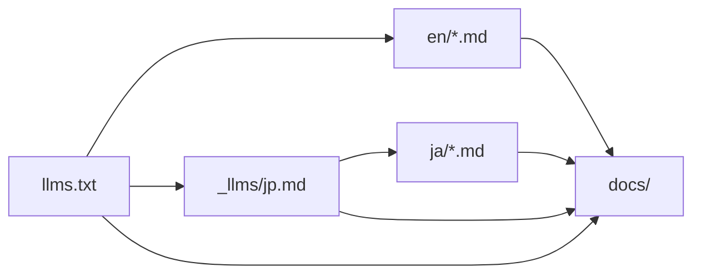
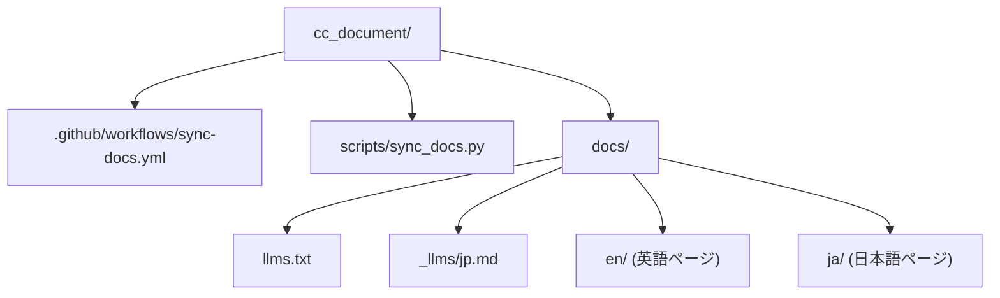

# cc_document

[Claude Code 公式ドキュメント](https://code.claude.com/docs/) の Markdown 版ミラーです。`https://code.claude.com/docs/llms.txt` が列挙するページを GitHub Actions が 2 日に 1 回取得し、差分があればコミットします。

## ミラーの範囲

`llms.txt` は英語ページを直接列挙し、末尾で言語別インデックス (`_llms/*.md`) を案内しています。このリポジトリは英語 (`en/`) と、日本語インデックス `_llms/jp.md` がたどれる日本語 (`ja/`) を取得します。他の言語を追加する場合は `scripts/sync_docs.py` の `DEFAULT_INDEXES` にインデックスのパスを加えます。

サイトが Markdown 以外 (HTML など) を返すパスはミラーに取り込まず、実行ログに `skip <path>: <media type>` として記録します。取得そのものに失敗した場合は 1 件でもジョブを失敗させ、ファイルの書き込みも削除も行いません。一時的な通信障害でミラーが欠けることを防ぐためです。



## ディレクトリ構成



`docs/` 配下は取得したバイト列をそのまま保存しており、手を加えません。上流から消えたページは次回の同期で削除されます。

## 手元で実行する

Python 3.10 以降があれば、追加の依存なしで動きます。

```bash
python scripts/sync_docs.py                       # docs/ を同期する
python scripts/sync_docs.py --dest /tmp/mirror    # 出力先を変える
python scripts/sync_docs.py --index _llms/jp.md --index _llms/cn.md  # たどるインデックスを指定する
```

終了時に `added <n>, updated <n>, removed <n>` を出力します。同じ内容のファイルは書き換えないため、変更がなければ `git status` はきれいなままです。

## 出典

ドキュメント本文の著作権は Anthropic に帰属します。このリポジトリは取得と保存を自動化するだけで、内容の改変は行いません。最新の正本は [code.claude.com/docs](https://code.claude.com/docs/) を参照してください。
